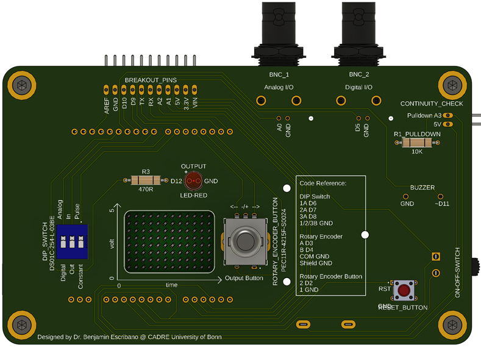
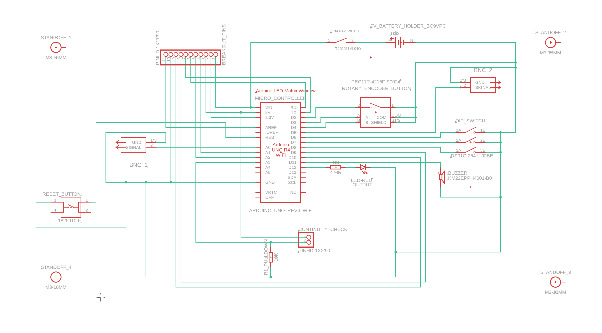
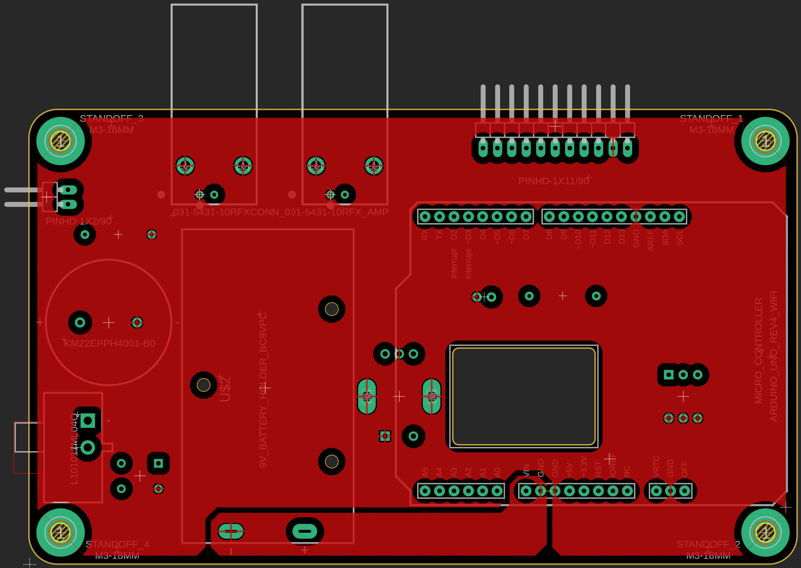

# BITboy

A handheld oscilloscope and behavioral setup debugger for neuroscientists. Your every-day companion for trouble shooting and setting up experimental instruments.

Read and write both analog and digital signals with ease. Check continuity in electronic circuits with the continuity checker. It can be used as a handheld oscilloscope or connected to your pc on a desk for higher resolution.

General disclaimer: Our BITboy is designed to work in a range of 0-5V and will take damage if connected to higher loads. Therefore, please be careful. We are planning a future version with overvoltage protection.

  
  

All provided files are in metric units (mm). The case can be 3D printed, while the cover can be lasercut or printed. The design aims at maximum reproduxibility with low total cost.

### Commercial Parts List

| Item | Quantity | Notes | Product Example Link |
| :---: | :---: | :---: | :---: |
| PCB | 1 piece | [custom design](PCB) | [eurocircuits.com](https://www.eurocircuits.com/) |
| Arduino UNO R4 Wifi | 1 piece | with LED matrix | [arduino.cc](https://store.arduino.cc/en-de/collections/boards-modules/products/uno-r4-wifi) |
| Pin Header 90 degrees | bar of 1x11 & 1x2 | attached | [conrad.de](https://www.conrad.de/de/p/econ-connect-stiftleiste-standard-anzahl-reihen-1-polzahl-je-reihe-40-sl25ws40gc-1-st-1883758.html) |
| Battery Holder | 1 piece | BC9VPC | [digikey.de](https://www.digikey.de/de/products/detail/mpd-memory-protection-devices/BC9VPC/257747) |
| Screw M2x8 mm | 3 pieces | for battery holder | [mercateo.com](https://www.mercateo.com/p/2805-M2X8(2f)D912(2d)A2/Schraube_M2x8_0_4_Kopf_Zylinder_Sechskant_HEX_1_5mm_DIN_912.html?ViewName=live~secureMode&chooseGeo=true&viewOptions=uiLanguage.en) |
| Nut M2 | 3 pieces | for battery holder | [digikey.de](https://www.mercateo.com/p/2805-B2(2f)BN628/Mutter_Sechskant_M2_0_4_A2_Edelstahl_4mm_BN_628_DIN_934.html?ViewName=live~secureMode!uiLanguage.en) |
| Washer M2 | 3 pieces | for battery holder | [digikey.de](https://www.mercateo.com/p/4502-16H910/Unterlegscheibe_M2_H_0_35_mm_Aussen_4_mm_Stahl_verzinkt_DIN_433_ISO_7092_.html?ViewName=live~secureMode!uiLanguage.en) |
| 9V Block Battery | 1 piece |  | [conrad.de](https://www.conrad.de/de/p/varta-longlife-power-9v-bli-2-9-v-block-batterie-alkali-mangan-580-mah-9-v-2-st-1012376.html) |
| On-Off Switch | 1 piece | L101011ML04Q | [digikey.de](https://www.digikey.de/de/products/detail/c-k/L101011ML04Q/3753550?s=N4IgTCBcDaIDIEYAMyEILJyQFgIogF0BfIA) |
| Rotary Encoder | 1 piece | PEC11R-4215F-S0024-ND | [digikey.de](https://www.digikey.de/de/products/detail/bourns-inc/PEC11R-4215F-S0024/4499665?s=N4IgTCBcDaIAoFEDCBGFAlAtAFjCgrAGKYDKADGWNiALoC%2BQA) |
| DIP Switch | 1 piece | DS01C-254-L-03BE | [digikey.de](https://www.digikey.de/de/products/detail/cui-devices/DS01C-254-L-03BE/11310858?s=N4IgTCBcDaICIGUAMBGAwgWjAVgCwYBkMkBmAIQFEQBdAXyA) |
| Piezo Buzzer | 1 piece | 490-4692-ND | [digikey.de](https://www.digikey.de/de/products/detail/murata-electronics/PKM22EPPH4001-B0/1219323?s=N4IgTCBcDaIAoGkCyYwFE5wBIBYAMeAjALQBCeIAugL5A) |
| Red LED | 1 piece | set of 100 | [conrad.de](https://www.conrad.de/de/p/led-5mm-rot-led5mm-rot-tht-leuchtdiode-set-100-stueck-847144284.html) |
| Tactile Switch | 1 piece | 450-1650-ND | [digikey.de](https://www.digikey.de/de/products/detail/te-connectivity-alcoswitch-switches/1825910-6/1632536) |
| BNC Connector | 1 piece | ARF1690-ND | [digikey.de](https://www.digikey.de/de/products/detail/amphenol-rf/031-5431-10RFX/2041816?s=N4IgTCBcDaIAwGYCMBaArAFmSpcBKAYgBogC6AvkA) |
| 470R Resistor | 1 piece | for LED | [conrad.de](https://www.conrad.de/de/p/yageo-cfr25j470rh-cfr-25jt-52-470r-kohleschicht-widerstand-470-axial-bedrahtet-0207-0-25-w-5-1-st-1417694.html) |
| 10K Resistor | 1 piece | puldown for continuity check | [digikey.de](https://www.conrad.de/de/p/yageo-cfr25j10kh-cfr-25jt-52-10k-kohleschicht-widerstand-10-k-axial-bedrahtet-0207-0-25-w-5-1-st-1417697.html) |
| Jumper Male-Female | 2 wires | for continuity check | [conrad.de](https://www.conrad.de/de/p/renkforce-jkmf403-jumper-kabel-arduino-banana-pi-raspberry-pi-40x-drahtbruecken-stecker-40x-drahtbruecken-buchse-30-2299844.html) |

### Case Parts

| Item | Quantity | Notes | Product Example Link |
| :---: | :---: | :---: | :---: |
| Case | 1 piece | [custom design](Case/BITboy_Case.stl) | 3D printed |
| Acrylic Cover (3 mm) | 1 piece | [custom design](Case/BITboy_Acrylic_Cover.stl) | lasercut, can be printed |
| Screw M3x10 mm | 8 pieces | self-tapping | [mercateo.com](https://www.mercateo.com/p/1498C-8000152817/Flachkopfschraube_DIN_85_ISO_1580_Schlitz_M3x10_4_8_galv_verz_200St_.html?ViewName=live~secureMode) |
| Washer M3 | 8 pieces |  | [mercateo.com](https://www.mercateo.com/p/4502-16H900/Unterlegscheibe_M3_H_0_5_mm_Aussen_7_mm_Stahl_verzinkt_DIN_125_ISO_7090_.html?ViewName=live~secureMode) |

All files are available as .STEP (for 3D CAD), .DXF Files (scaling: 1pt equals 1mm for laser cutting), .STL (3D Object for Printing). Electronics are provided as fusion arcive files (.f3z) and gerber files for PCB production with eurocircuits.

Wiring Diagram
--------------------

  

PCB Layout
--------------------

  
  

Pin Layout
--------------------

### Red LED

| Arduino Pin | Connected to | Note |
| :---: | :---: | :---: |
| D12 | red LED + (long) | via 470R resistor |
| GND | red LED - |  |

### Piezo Buzzer

| Arduino Pin | Connected to | Note |
| :---: | :---: | :---: |
| D11 | piezzo buzzer + | PWM (pulse width modulation) |
| GND | piezzo buzzer - |  |

### BNC 1 Analog I/O

| Arduino Pin | Connected to | Note |
| :---: | :---: | :---: |
| A0 | BNC connector signal pin | for DAC |
| GND | BNC connector shield/GND |  |

### BNC 2 Digital I/O

| Arduino Pin | Connected to | Note |
| :---: | :---: | :---: |
| D5 | BNC connector signal pin |  |
| GND | BNC connector shield/GND |  |

### DIP Switch (Dual in-line package)

| Arduino Pin | Connected to | Note |
| :---: | :---: | :---: |
| D6 | 1 A |  |
| D7 | 2 A |  |
| D8 | 3 A |  |
| GND | 1/2/3 B |  |

### Rotary Encoder with Button

| Arduino Pin | Connected to | Note |
| :---: | :---: | :---: |
| D2 | button 2 | interrupt pin |
| GND | button 1 |  |
| D3 | encoder A | interrupt pin |
| D4 | encoder B |  |
| GND | encoder shield & COM |  |

### Continuity Check

| Arduino Pin | Connected to | Note |
| :---: | :---: | :---: |
| A3 | 1x2 pin header | with 10K pulldown resistor to GND |
| 5V | 1x2 pin header |  |

### Reset Button

| Arduino Pin | Connected to | Note |
| :---: | :---: | :---: |
| RST | tactile switch A |  |
| GND | tactile switch B |  |

[Here you find an example for using the RST pin with a tactile switch](https://www.circuitschools.com/external-reset-button-for-arduino-or-reset-arduino-with-code/)

### ON-OFF Switch and Battery

| Arduino Pin | Connected to | Note |
| :---: | :---: | :---: |
| VIN | switch + |  |
| battery holder + | switch - |  |
| GND | battery holder - |  |

[Here you find more about powering options for Arduinos](https://docs.arduino.cc/learn/electronics/power-pins/)

[Here you find an example and pictures for powering with a battery](https://www.instructables.com/Powering-Arduino-with-a-Battery/)

### Breakout Pins

| Arduino Pin | Connected to | Note |
| :---: | :---: | :---: |
| AREF | 1x11 pin header | for custom code |
| GND | 1x11 pin header | for custom code |
| D10 | 1x11 pin header | for custom code |
| D9 | 1x11 pin header | for custom code |
| TX | 1x11 pin header | for custom code |
| RX | 1x11 pin header | for custom code |
| A2 | 1x11 pin header | for custom code |
| A1 | 1x11 pin header | for custom code |
| 5V | 1x11 pin header | for custom code |
| 3.3V | 1x11 pin header | for custom code |
| VIN | 1x11 pin header | for custom code |

Modular-Door Control Logic
--------------------

| Module | Analog In Pulse/Constant | Analog Out Pulse | Analog Out Constant |Digital In Pulse/Constant | Digital Out Pulse | Digital Out Constant |
| :---: | :---: | :---: | :---: | :---: | :---: | :---: |
| BNC_1 Analog I/O | Analog Read | Analog Write | Analog Write | Idle | Idle | Idle |
| BNC_2 Digital I/O | Idle | Idle | Idle | Digital Read | Digital Write | Digital Write |
| Rotary Encoder | Temporal Resolution | Set Voltage | Set Voltage | Temporal Resolution | Idle | Idle |
| Rotary Button | Idle | Hold | Toggle | Idle | Hold | Toggle |
| Output LED-Red | Idle | Write Indicator | Write Indicatr | Idle | Write Indicator | Write Indicator |
| Buzzer | Coupled Continuity |  |  |  |  |  |
| LED Matrix | Analog Voltage | Analog Voltage | Analog Voltage | Digital Voltage | Digital Voltage | Digital Voltage |
| Continuity Check | Active |  |  |  |  |  |
| Breakout Pins | Idle for custom programming |  |  |  |  |  |
| Reset Button | Reset and Readout settings mode |  |  |  |    |

Lasercutting
--------------------

We used a Trotec Speedy Flex lasercutter with a 100W CO2 laser with the following settings for 3 mm acrylic glass:

| Parameter | Cutting Quality |
| :---: | :---: |
| Power | 40 Watts |
| Speed | 0,2 % |
| Laser Source | CO2 |
| Frequency | 20000 |
| Passes | 1 |
| Power Correction | 10 |
| z-Offset | 0 |

3D Printing
--------------------
We suggest printing with PLA, tough PLA or ABS for best results. Any standard print settings will provide aceptable results. Avoid fancy materials to reduce cost and effort.

For the case, we used a Babulab A1 mini filament printer with generic PLA.
