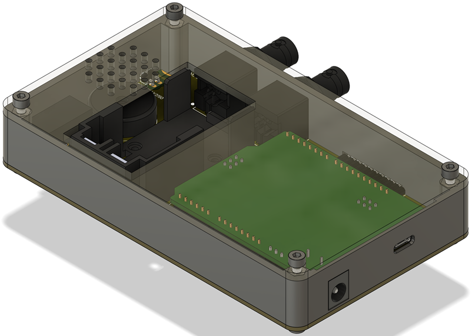
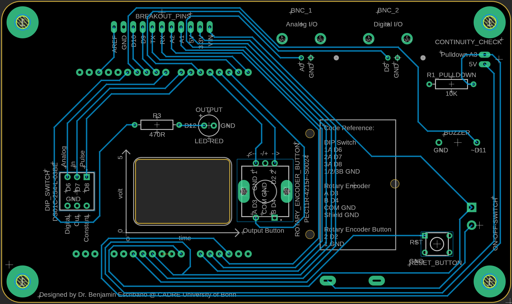

# BITboy

A handheld oscilloscope and behavior setup debugger for neuroscientists. Your every-day companion for trouble shooting and setting up experimental instruments.

Read and write analog as well as digital signals with ease. Check continuity in electronic circuits with the continuity checker. It can be used as a handheld oscilloscope or connected to your pc on a desk for higher resolution.

  
  

All provided files are in metric units (mm). The case can be 3D printed, while the cover can be lasercut or printed. The design aims at maximum reproduxibility with low total cost.

### Commercial Parts List

| Item | Quantity | Notes | Product Example Link |
| :---: | :---: | :---: | :---: |
| PCB | 1 piece | custom design | [eurocircuits.com](https://www.eurocircuits.com/) |
| Arduino UNO R4 Wifi | 1 piece | with LED matrix | [arduino.cc](https://store.arduino.cc/en-de/collections/boards-modules/products/uno-r4-wifi) |
| Pins 90 degrees | bar of 11+2 | attached | [conrad.de](https://www.conrad.de/de/p/econ-connect-stiftleiste-standard-anzahl-reihen-1-polzahl-je-reihe-40-sl25ws40gc-1-st-1883758.html) |
| Battery Holder | 1 piece | BC9VPC | [digikey.de](https://www.digikey.de/de/products/detail/mpd-memory-protection-devices/BC9VPC/257747) |
| Screw M2x8 mm | 3 pieces | for battery holder | [mercateo.com](https://www.mercateo.com/p/2805-M2X8(2f)D912(2d)A2/Schraube_M2x8_0_4_Kopf_Zylinder_Sechskant_HEX_1_5mm_DIN_912.html?ViewName=live~secureMode&chooseGeo=true&viewOptions=uiLanguage.en) |
| Nut M2 | 3 pieces | for battery holder | [digikey.de](https://www.mercateo.com/p/2805-B2(2f)BN628/Mutter_Sechskant_M2_0_4_A2_Edelstahl_4mm_BN_628_DIN_934.html?ViewName=live~secureMode!uiLanguage.en) |
| Washer M2 | 3 pieces | for battery holder | [digikey.de](https://www.mercateo.com/p/4502-16H910/Unterlegscheibe_M2_H_0_35_mm_Aussen_4_mm_Stahl_verzinkt_DIN_433_ISO_7092_.html?ViewName=live~secureMode!uiLanguage.en) |
| 9V Block Battery | 1 piece |  | [conrad.de](https://www.conrad.de/de/p/varta-longlife-power-9v-bli-2-9-v-block-batterie-alkali-mangan-580-mah-9-v-2-st-1012376.html) |
| On-Off Switch | 1 piece | L101011ML04Q | [digikey.de](https://www.digikey.de/de/products/detail/c-k/L101011ML04Q/3753550?s=N4IgTCBcDaIDIEYAMyEILJyQFgIogF0BfIA) |
| Rotary Encoder | 1 piece | PEC11R-4215F-S0024-ND | [digikey.de](https://www.digikey.de/de/products/detail/bourns-inc/PEC11R-4215F-S0024/4499665?s=N4IgTCBcDaIAoFEDCBGFAlAtAFjCgrAGKYDKADGWNiALoC%2BQA) |
| DIP Switch | 1 piece | DS01C-254-L-03BE | [digikey.de](https://www.digikey.de/de/products/detail/cui-devices/DS01C-254-L-03BE/11310858?s=N4IgTCBcDaICIGUAMBGAwgWjAVgCwYBkMkBmAIQFEQBdAXyA) |
| Piezo Buzzer | 1 piece | 490-4692-ND | [digikey.de](https://www.digikey.de/de/products/detail/murata-electronics/PKM22EPPH4001-B0/1219323?s=N4IgTCBcDaIAoGkCyYwFE5wBIBYAMeAjALQBCeIAugL5A) |
| Red LED | 1 piece | set of 100 | [conrad.de](https://www.conrad.de/de/p/led-5mm-rot-led5mm-rot-tht-leuchtdiode-set-100-stueck-847144284.html) |
| Tactile Switch | 1 piece | 450-1650-ND | [digikey.de](https://www.digikey.de/de/products/detail/te-connectivity-alcoswitch-switches/1825910-6/1632536) |
| BNC Connector | 1 piece | ARF1690-ND | [digikey.de](https://www.digikey.de/de/products/detail/amphenol-rf/031-5431-10RFX/2041816?s=N4IgTCBcDaIAwGYCMBaArAFmSpcBKAYgBogC6AvkA) |
| 470R Resistor | 1 piece |  | [digikey.de]() |
| 1K Resistor | 1 piece |  | [digikey.de]() |
| Jumper Male-Female | 2 wires | for continuity check | [conrad.de](https://www.conrad.de/de/p/renkforce-jkmf403-jumper-kabel-arduino-banana-pi-raspberry-pi-40x-drahtbruecken-stecker-40x-drahtbruecken-buchse-30-2299844.html) |

For case
sdandoffs or case
Screws
Washers

### File List

| Door-Module Component | Production Amount | Material |
| :---: | :---: | :---: |
| Arduino Holder | 1 piece | Acrylic glass 6mm, PLA or ABS |

All files are available as .STEP (for 3D CAD), .DXF Files (scaling: 1pt equals 1mm for laser cutting), .STL (3D Object for Printing) and .SVG (Open Source Vector Graphic).

And DXF

Wiring Diagram
--------------------

  

PCB Layout
--------------------

  
  

Pin Layout
--------------------

Modular-Door Control Logic
--------------------

Input detection is via digital input and internal pullup resistor. Consequently, 0V (or connecting to GND) at the signal in port will open the door, while 5V will close it again. Sync ports will be set to the corresponding output current.

| BNC In Signal | Door Status | BNC Sync 1 Status | BNC Sync 2 Status |
| :---: | :---: | :---: | :---: |
| 5V (High) input | Closed (Up) | 5V output | 5V output |
| 0V (Low) input | Open (Down) | 0V output | 0V output |

Useful Resources
--------------------

pullup and pulldown resistors
Built in functions and Operators
Arduino Functions
DigitalRead/Write
Rotary encoder example
Buzzer example
LED example
DIP switch example
Reset button example
Power via Battery example
Continuity check example
BNC example

Lasercutting
--------------------

We used a Trotec Speedy Flex lasercutter with a 100W CO2 laser with the following settings for 3 mm acrylic glass:

| Parameter | Cutting Quality |
| :---: | :---: |
| Power | 40 % |
| Speed | 0,2 % |
| Laser Source | CO2 |
| Frequency | 20000 |
| Passes | 1 |
| Power Correction | 10 |
| z-Offset | 0 |

3D Printing
--------------------
We suggest printing with PLA, tough PLA or ABS for best results. Any standard print settings will provide aceptable results. Avoid fancy materials to reduce cost and effort.

For the case, we used a Babulab A1 mini filament printer with generic PLA.